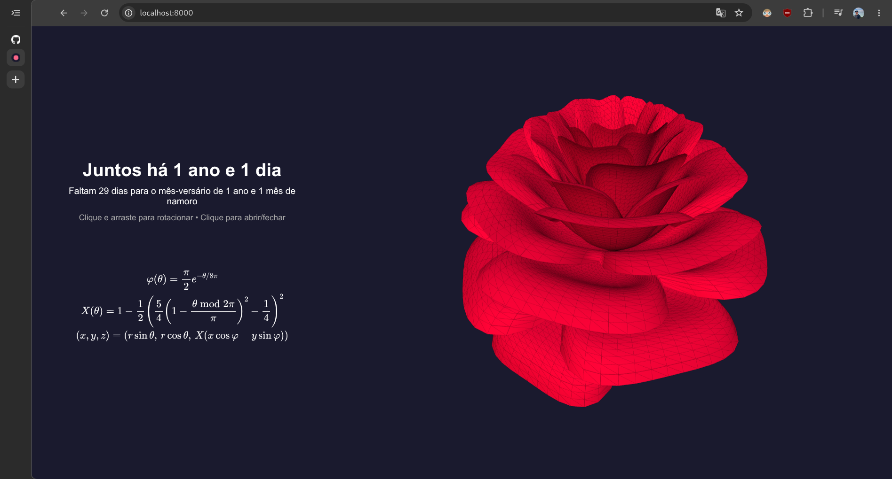
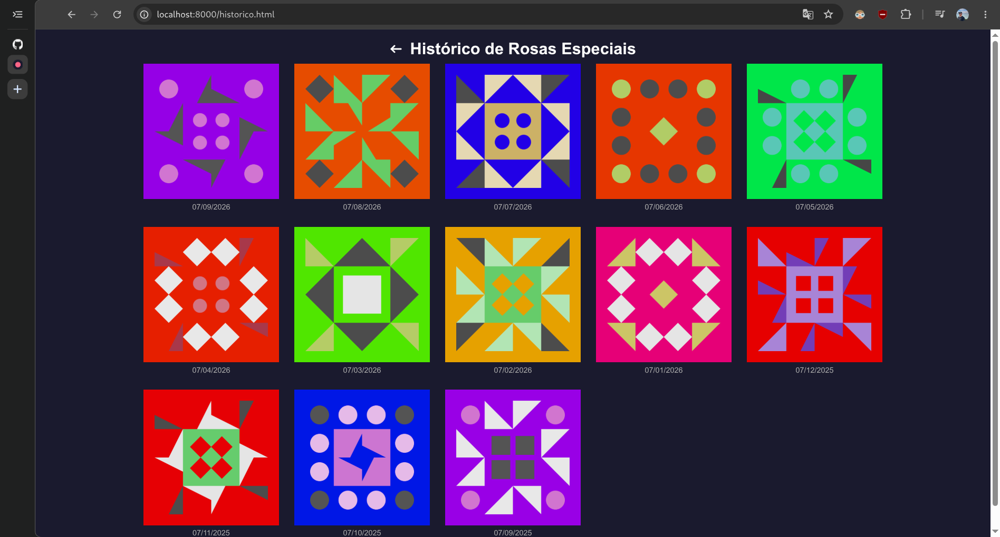
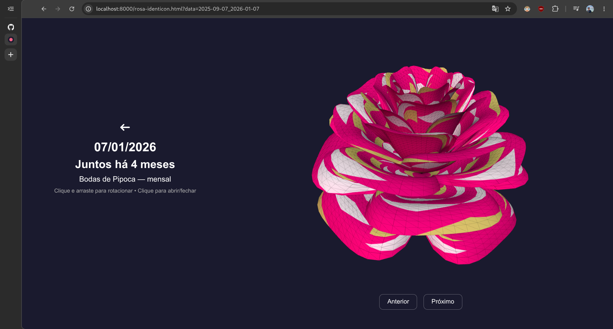

# Rosa 3D

Uma página web interativa e romântica que exibe uma rosa tridimensional paramétrica. Inclui animação de abrir e fechar pétalas, contador de tempo de namoro, contador regressivo para o próximo mês-versário, sistema completo de **Bodas de Namoro** e **Rosas Especiais** com texturas identicon únicas em cada data comemorativa.

## Funcionalidades

- **Rosa 3D Paramétrica**: gerada matematicamente com a fórmula de Paul Nylander usando Three.js
- **Animação de Abrir/Fechar**: clique na tela para ver a rosa abrir ou fechar suas pétalas com transição suave
- **Contador de Relacionamento**: exibe o tempo de namoro em anos, meses e dias, atualizado dinamicamente no texto principal da página
- **Contador Regressivo**: mostra quantos dias faltam para o próximo mês-versário ou aniversário
- **Bodas de Namoro**: sistema completo com bodas mensais (1–11 meses), bodas anuais (1–15 anos) e sub-bodas mensais dentro de cada ano
- **Ciclo de Informações**: clique no título "Juntos há..." para alternar entre o tempo de namoro e o nome da boda atual (mensal e/ou anual)
- **Rosa Especial (Identicon)**: nos dias de mês-versário ou aniversário, a rosa ganha uma textura procedural única gerada por hash da data, com padrão Jdenticon e cor de fundo determinística
- **Histórico de Rosas Especiais**: segure o título "Juntos há..." por cerca de 400 ms para acessar uma galeria com todas as datas comemorativas e seus identicons exclusivos
- **Navegação entre Datas**: na página da Rosa Especial, use os botões "Anterior" e "Próximo" para percorrer o histórico de mês-versários
- **Interatividade**: rotacione a câmera arrastando com o mouse (ou toque)
- **Trava de Rotação**: clique e segure (~400 ms) para travar ou destravar a rotação automática da rosa
- **Fórmula LaTeX Clicável**: clique na fórmula matemática para abrir o artigo original do Paul Nylander
- **Wireframe Overlay**: malha wireframe semi-transparente sobreposta para realce visual
- **Responsivo**: adaptado para desktop e dispositivos móveis

## Demonstração

### Página Principal


### Histórico de Rosas Especiais


### Rosa Especial (Identicon)


## Tecnologias

- HTML5
- CSS3
- JavaScript (Vanilla)
- [Three.js](https://threejs.org/) (via CDN)
- [MathJax](https://www.mathjax.org/) (via CDN) — renderização da fórmula LaTeX
- [Jdenticon](https://jdenticon.com/) (via CDN) — geração de identicons procedurais

## Como executar localmente

Abra o `index.html` diretamente no navegador ou use um servidor local:

```bash
# Navegue até a pasta do projeto e abra o arquivo
# Ou utilize um servidor local simples:
npx serve .
# ou
python3 -m http.server 8000
```

## Personalização

### Alterar a data de início do namoro

Para adaptar o projeto ao seu relacionamento, edite o arquivo `config.js`:

```javascript
const DATA_INICIO = new Date(2025, 8, 7); // 7 de setembro de 2025
```

> **Importante:** no JavaScript, o mês é *zero-indexed* (janeiro = 0, fevereiro = 1, ..., setembro = 8).

Altere essa linha para a data desejada, mantendo o formato `new Date(ano, mes, dia)`. Tanto o contador de tempo de namoro quanto o contador regressivo usarão automaticamente essa mesma constante.

### Simular uma data para testes

O arquivo `config.js` também possui a constante `DATA_ATUAL`, que permite simular uma data específica (útil para testar bodas futuras e o comportamento da Rosa Especial):

```javascript
const DATA_ATUAL = new Date();
// const DATA_ATUAL = new Date(2026, 8, 7); // Descomente para testar essa data
```

### Bodas de Namoro

As bodas estão definidas no arquivo `bodas.js` em três categorias:

- **`mensais`**: bodas do 1º ao 11º mês
- **`anuais`**: bodas de cada ano (1 a 15 anos)
- **`subAnuais`**: sub-bodas mensais dentro de cada ano (1.1 a 9.11)

Você pode editar os nomes das bodas livremente nesse arquivo.

## Como funciona o ciclo de cliques no título

Clique no texto principal "Juntos há..." para alternar entre as informações:

| Período | 1º clique | 2º clique | 3º clique |
|---------|-----------|-----------|-----------|
| **1–11 meses** | Juntos há... | Boda mensal | *(volta)* |
| **Ano redondo** (ex: 1 ano) | Juntos há... | Boda anual | *(volta)* |
| **Ano + meses** (ex: 1 ano e 2 meses) | Juntos há... | Boda mensal | Boda anual |

O ciclo sempre retorna ao tempo de namoro após mostrar as bodas disponíveis.

> **Dica:** segure o título por cerca de 400 ms para acessar o **Histórico de Rosas Especiais**.

## Estrutura do projeto

```
rosa-3d/
├── index.html              # Página principal com a rosa 3D
├── style.css               # Estilos responsivos (desktop + mobile)
├── script.js               # Lógica principal, Three.js e interatividade
├── config.js               # Configurações (data de início e data atual)
├── bodas.js                # Base de dados das bodas de namoro
├── identicon.js            # Geração de texturas identicon procedurais
├── historico.html          # Galeria do histórico de rosas especiais
├── historico.css           # Estilos da página de histórico
├── rosa-identicon.html     # Visualização individual de uma rosa especial
├── rosa-identicon.js       # Lógica da rosa especial com navegação
├── rosa-identicon.css      # Estilos da página da rosa especial
├── favicon.svg             # Ícone do site
└── images/                 # Screenshots e imagens do projeto
    ├── home.png
    ├── historico.png
    └── rosa-especial.png
```

## Referências

- [Paul Nylander — Rose-Shaped Parametric Surface](https://nylander.wordpress.com/2006/06/21/rose-shaped-parametric-surface/) — artigo original com a fórmula matemática utilizada para gerar a rosa 3D.
